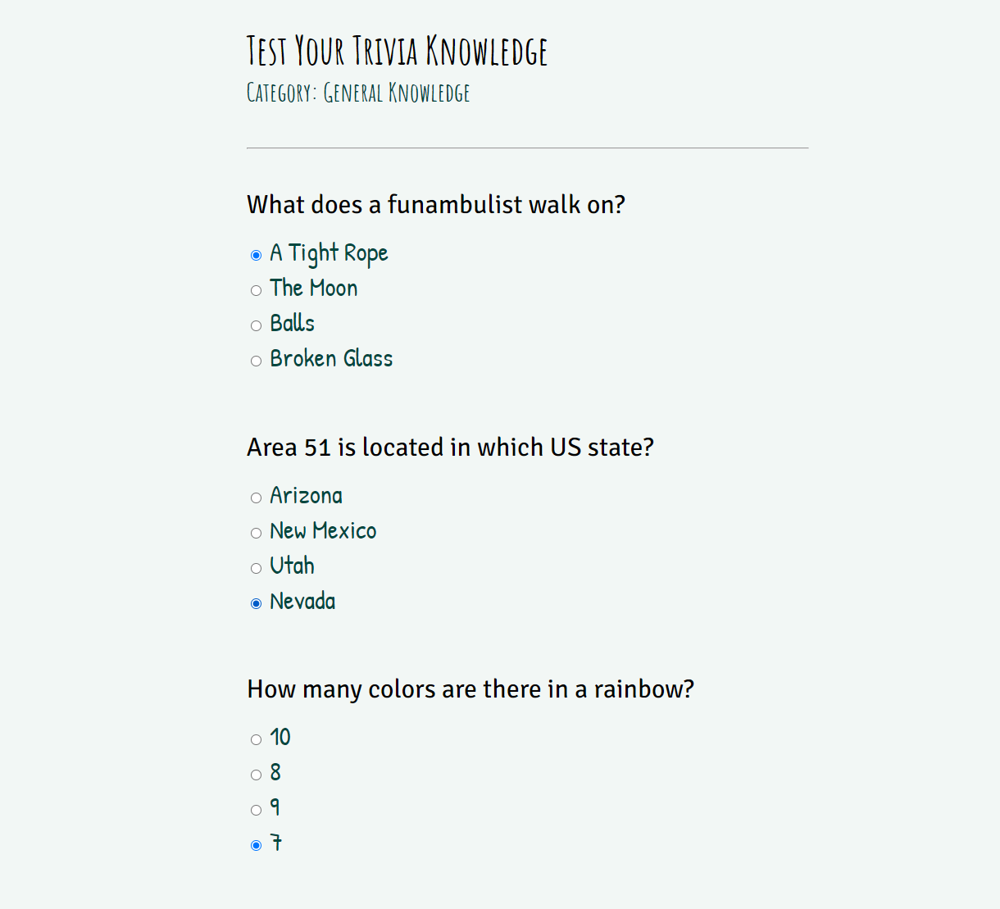

# Trivia Game in Flask
This project utilizes Object-Oriented Programming (OOP) in conjunction with the Open Trivia DB API and Flask to create a multiple-choice web application game with randomized trivia questions. 

